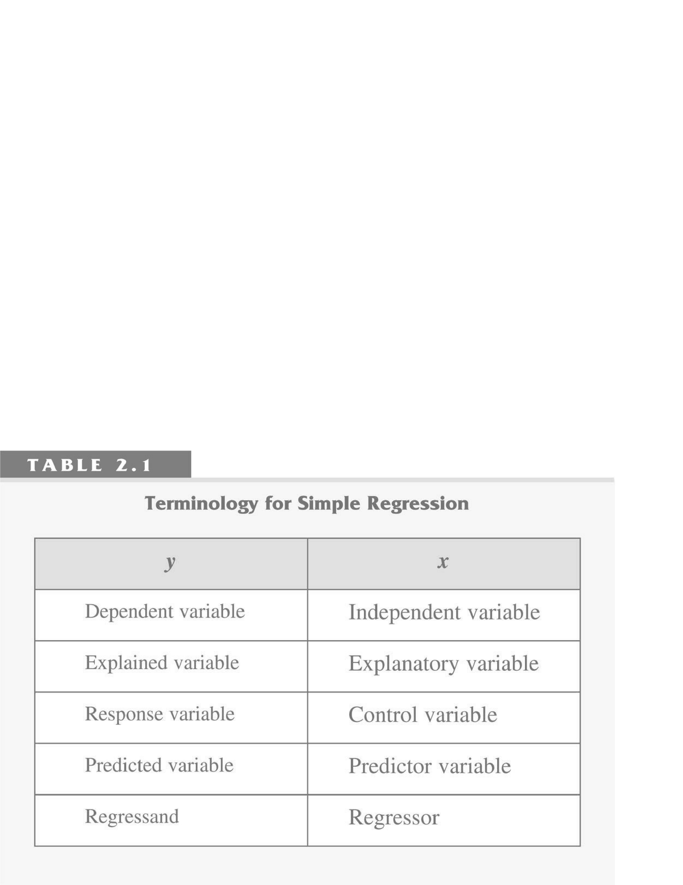
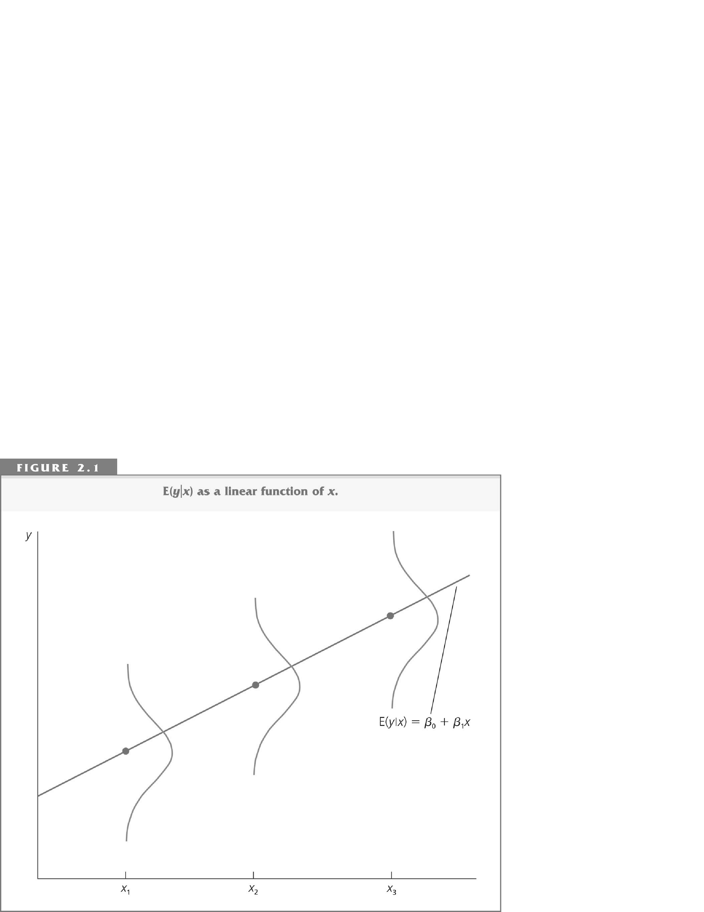
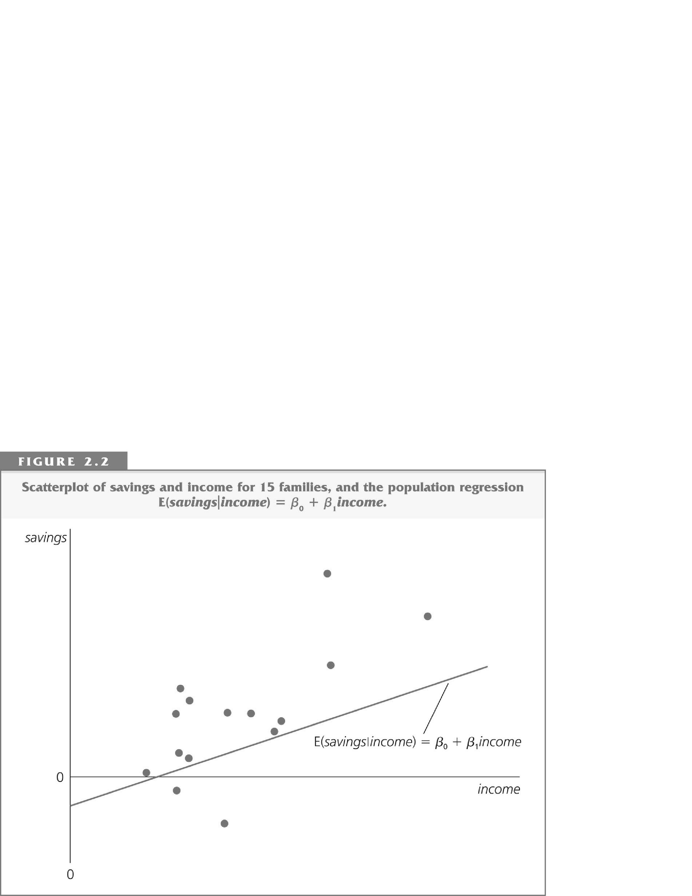
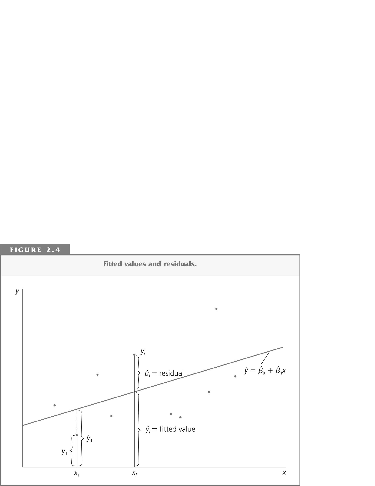
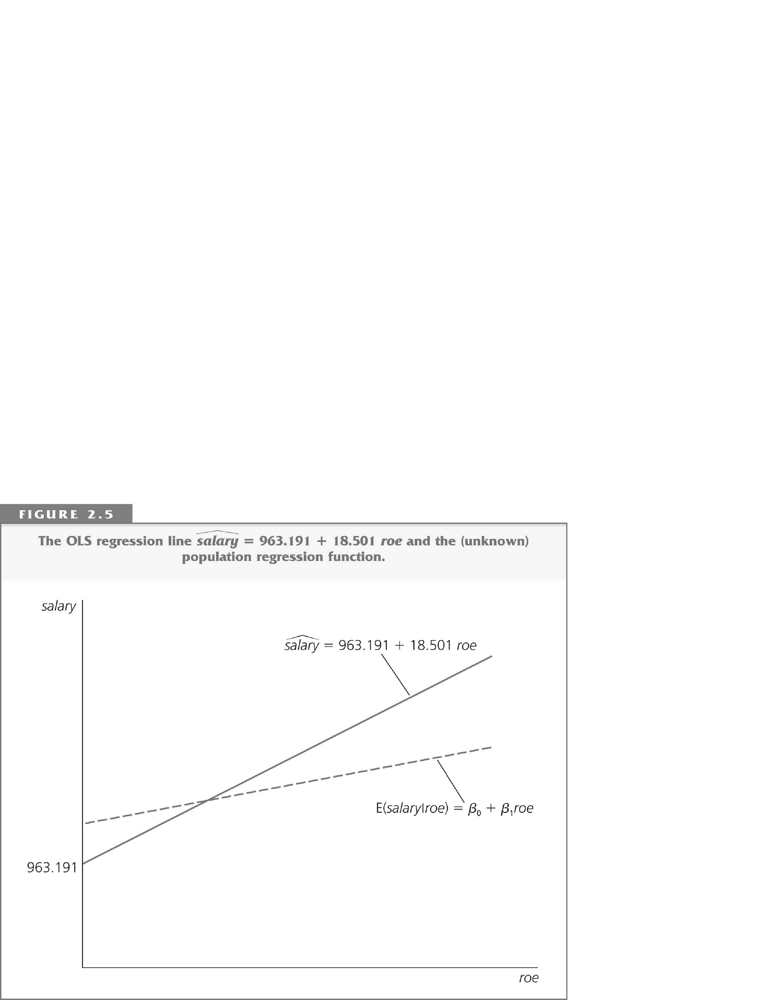

## Introduction
- The **simple linear regression model** is used to study the relationship between **two variables**.
- It has many limitations, but nevertheless there are examples in the literature where the simple linear regression is applied (e.g., stock returns predictability).
- It is also a good starting point to learning the regression technique.

## Definitions
::: {.content-visible when-format="pdf"}
\begin{center}
\includegraphics[trim=0 0 0 5.6in,clip]{figures/tab2-1.png}
\end{center}
:::

::: {.content-visible when-format="html"}
::: {.tight-figure .figure-crop .figure-crop-51}

:::
:::

::: {.content-visible when-format="revealjs"}

:::

## Sample and population

- The econometrician observes random data:

  | observation | dependent variable | regressor |
  |------------|--------------------|-----------|
  | 1 | $Y_{1}$ | $X_{1}$ |
  | 2 | $Y_{2}$ | $X_{2}$ |
  | $\vdots$ | $\vdots$ | $\vdots$ |
  | $n$ | $Y_{n}$ | $X_{n}$ |

- A pair $X_{i}, Y_{i}$ is called an observation.
- **Sample**: $\left\{ \left( X_{i},Y_{i}\right) : i=1,\ldots,n\right\}$.
- The population is the **joint distribution** of the sample.

## The model

- We model the relationship between $Y$ and $X$ using the **conditional expectation**:
$$
E\left( Y_{i}|X_{i}\right) = \alpha + \beta X_{i}.
$$

- **Intercept**: $\alpha = E\left( Y_{i}|X_{i}=0\right)$.

- **Slope**: $\beta$ measures the effect of a unit change in $X$ on $Y$:
$$
\begin{aligned}
\beta &= E\left( Y_{i}|X_{i}=x+1\right) - E\left( Y_{i}|X_{i}=x\right) \\
&= \left[ \alpha + \beta (x+1)\right] - \left[ \alpha + \beta x\right].
\end{aligned}
$$

- **Marginal effect** of $X$ on $Y$:
$$
\beta = \frac{dE\left( Y_{i}|X_{i}\right)}{dX_{i}}.
$$

- **The effect is the same for all $x$**.

## The model

- $\alpha$ and $\beta$ in $E\left( Y_{i}|X_{i}\right) = \alpha + \beta X_{i}$ are **unknown**.
- **Residual (error)**:
$$
U_{i} = Y_{i} - E\left( Y_{i}|X_{i}\right) = Y_{i} - \left( \alpha + \beta X_{i}\right).
$$
  $U_{i}$'s are **unobservable**.

- **The model**:
$$
\begin{aligned}
Y_{i} &= \alpha + \beta X_{i} + U_{i}, \\
E\left( U_{i}|X_{i}\right) &= 0.
\end{aligned}
$$

## Functional form

- We consider a model that is linear in the coefficients $\alpha,\beta$: $Y_{i} = \alpha + \beta X_{i} + U_{i}$.
- The dependent variable and the regressor can be nonlinear functions of some other variables.
- The most popular function is $\log$.

## Functional form: the log-linear model

- Consider the following model:
$$
\log Y_{i} = \alpha + \beta X_{i} + U_{i}.
$$

- In this case,
$$
\begin{aligned}
\beta &= \frac{d\left( \log Y_{i}\right)}{dX_{i}} \\
&= \frac{dY_{i}/Y_{i}}{dX_{i}} = \frac{dY_{i}/dX_{i}}{Y_{i}}.
\end{aligned}
$$

- $\beta$ measures **percentage** change in $Y$ as a response to a unit change in $X$.
- In this model, it is assumed that the percentage change in $Y$ is the same for all values of $X$ (constant).
- In $\log \left( \text{Wage}_{i}\right) = \alpha + \beta \times \text{Education}_{i} + U_{i}$, $\beta$ measures the **return** to education.

## Functional form: the log-log model

- Consider the following model:
$$
\log Y_{i} = \alpha + \beta \log X_{i} + U_{i}.
$$

- In this model,
$$
\begin{aligned}
\beta &= \frac{d\log Y_{i}}{d\log X_{i}} \\
&= \frac{dY_{i}/Y_{i}}{dX_{i}/X_{i}} = \frac{dY_{i}}{dX_{i}}\frac{X_{i}}{Y_{i}}.
\end{aligned}
$$

- $\beta$ measures **elasticity**: the percentage change in $Y$ as a response to 1\% change in $X$.
- Here, the elasticity is assumed to be the same for all values of $X$.
- Example: Cobb-Douglas production function:
$$
Y=\alpha K^{\beta_{1}}L^{\beta_{2}} \Longrightarrow \log Y=\log \alpha + \beta_{1}\log K + \beta_{2}\log L
$$
  (two regressors: log of capital and log of labour).

## Orthogonality of residuals

The model:
$$
Y_{i} = \alpha + \beta X_{i} + U_{i}.
$$

We assume that $E\left( U_{i}|X_{i}\right) = 0$.

- $E U_{i} = 0$.
$$
E U_{i} \overset{\text{Law of Iterated Expectation}}{=} E\,E\left( U_{i}|X_{i}\right) = E\,0 = 0.
$$

- $Cov\left( X_{i},U_{i}\right) = E X_{i}U_{i} = 0$.
$$
\begin{aligned}
E X_{i}U_{i} &\overset{\text{Law of Iterated Expectation}}{=} E\,E\left( X_{i}U_{i}|X_{i}\right) \\
&= E\left[ X_{i} E\left( U_{i}|X_{i}\right) \right] = E\left[ X_{i} 0 \right] = 0.
\end{aligned}
$$

## The model

$$
Y_{i} = \underbrace{\alpha + \beta X_{i}}_{\text{Predicted by } X} + \underbrace{U_{i}}_{\text{Orthogonal to } X}
$$

::: {.content-visible when-format="pdf"}
\begin{center}
\includegraphics[trim=0 0 0 5.53in,clip]{figures/fig2-1.png}
\end{center}
:::

::: {.content-visible when-format="html"}
::: {.tight-figure .figure-crop .figure-crop-50}

:::
:::

::: {.content-visible when-format="revealjs"}
::: {.fragment}

:::
:::

## Estimation problem

::: {.content-visible when-format="pdf"}
\begin{center}
\includegraphics[trim=0 0 0 5.54in,clip]{figures/fig2-2.png}
\end{center}
:::

::: {.content-visible when-format="html"}
::: {.tight-figure .figure-crop .figure-crop-50}

:::
:::

::: {.content-visible when-format="revealjs"}

:::

**Problem:** estimate the unknown parameters $\alpha$ and $\beta$ using the data ($n$ observations) on $Y$ and $X$.

## Method of moments

- We assume that
$$
\begin{aligned}
E U_{i} &= E\left( Y_{i} - \alpha - \beta X_{i}\right) = 0. \\
E X_{i}U_{i} &= E X_{i}\left( Y_{i} - \alpha - \beta X_{i}\right) = 0.
\end{aligned}
$$

- An **estimator** is a function of the observable data; it can depend only on observable $X$ and $Y$. Let $\hat{\alpha}$ and $\hat{\beta}$ denote the estimators of $\alpha$ and $\beta$.

- **Method of moments:** replace expectations with averages. **Normal equations**:
$$
\begin{aligned}
\frac{1}{n}\sum_{i=1}^{n}\left( Y_{i} - \hat{\alpha} - \hat{\beta} X_{i}\right) &= 0. \\
\frac{1}{n}\sum_{i=1}^{n}X_{i}\left( Y_{i} - \hat{\alpha} - \hat{\beta} X_{i}\right) &= 0.
\end{aligned}
$$

## Solution

::: {.nonincremental}
- Let $\bar{Y}=\frac{1}{n}\sum_{i=1}^{n}Y_{i}$ and $\bar{X}=\frac{1}{n}\sum_{i=1}^{n}X_{i}$ (averages).

  $$
  \frac{1}{n}\sum_{i=1}^{n}\left( Y_{i} - \hat{\alpha} - \hat{\beta}X_{i}\right) = 0
  $$
    implies
  $$
  \begin{aligned}
  \frac{1}{n}\sum_{i=1}^{n}Y_{i} - \frac{1}{n}\sum_{i=1}^{n}\hat{\alpha} - \hat{\beta}\frac{1}{n}\sum_{i=1}^{n}X_{i} &= 0 \text{ or} \\
  \bar{Y} - \hat{\alpha} - \hat{\beta}\bar{X} &= 0.
  \end{aligned}
  $$

  The fitted regression line goes through the averages.

-
  $$
  \hat{\alpha} = \bar{Y} - \hat{\beta}\bar{X}.
  $$
:::

## Solution

- $\hat{\alpha} = \bar{Y} - \hat{\beta}\bar{X}$ and therefore
$$
\begin{aligned}
0 &= \frac{1}{n}\sum_{i=1}^{n}X_{i}\left( Y_{i} - \hat{\alpha} - \hat{\beta} X_{i}\right) \\
&= \sum_{i=1}^{n}X_{i}\left( Y_{i} - \left( \bar{Y} - \hat{\beta}\bar{X}\right) - \hat{\beta}X_{i}\right) \\
&= \sum_{i=1}^{n}X_{i}\left[ \left( Y_{i} - \bar{Y}\right) - \hat{\beta}\left( X_{i} - \bar{X}\right) \right] \\
&= \sum_{i=1}^{n}X_{i}\left( Y_{i} - \bar{Y}\right) - \hat{\beta}\sum_{i=1}^{n}X_{i}\left( X_{i} - \bar{X}\right).
\end{aligned}
$$

## Solution

- 
$$
0 = \sum_{i=1}^{n}X_{i}\left( Y_{i} - \bar{Y}\right) - \hat{\beta}\sum_{i=1}^{n}X_{i}\left( X_{i} - \bar{X}\right) \text{ or}
$$
$$
\hat{\beta} = \frac{\sum_{i=1}^{n}X_{i}\left( Y_{i} - \bar{Y}\right)}{\sum_{i=1}^{n}X_{i}\left( X_{i} - \bar{X}\right)}.
$$

- Since
$$
\begin{aligned}
\sum_{i=1}^{n}X_{i}\left( Y_{i} - \bar{Y}\right) &= \sum_{i=1}^{n}\left( X_{i} - \bar{X}\right) \left( Y_{i} - \bar{Y}\right) = \sum_{i=1}^{n}\left( X_{i} - \bar{X}\right) Y_{i} \text{ and} \\
\sum_{i=1}^{n}X_{i}\left( X_{i} - \bar{X}\right) &= \sum_{i=1}^{n}\left( X_{i} - \bar{X}\right)\left( X_{i} - \bar{X}\right) = \sum_{i=1}^{n}\left( X_{i} - \bar{X}\right)^{2}
\end{aligned}
$$
  we can also write
$$
\hat{\beta} = \frac{\sum_{i=1}^{n}\left( X_{i} - \bar{X}\right) Y_{i}}{\sum_{i=1}^{n}\left( X_{i} - \bar{X}\right)^{2}}.
$$

## Fitted line

::: {.nonincremental}
- **Fitted values**: $\hat{Y}_{i} = \hat{\alpha} + \hat{\beta}X_{i}$.
- **Fitted residuals**: $\hat{U}_{i} = Y_{i} - \hat{\alpha} - \hat{\beta}X_{i}$.
:::

::: {.content-visible when-format="pdf"}
\begin{center}
\includegraphics[trim=0 0 0 5.53in,clip,width=0.85\linewidth]{figures/fig2-4.png}
\end{center}
:::

::: {.content-visible when-format="html"}
::: {.tight-figure .figure-crop .figure-crop-50 .figure-crop-small}

:::
:::

::: {.content-visible when-format="revealjs"}

:::

## True line and fitted line

::: {.nonincremental}
- **True:** $Y_{i} = \alpha + \beta X_{i} + U_{i}$, $E U_{i} = E X_{i}U_{i} = 0$.
- **Fitted:** $Y_{i} = \hat{\alpha} + \hat{\beta} X_{i} + \hat{U}_{i}$, $\sum_{i=1}^{n}\hat{U}_{i} = \sum_{i=1}^{n}X_{i}\hat{U}_{i} = 0$.
:::

::: {.content-visible when-format="pdf"}
\begin{center}
\includegraphics[trim=0 0 0 5.54in,clip,width=0.85\linewidth]{figures/fig2-5.png}
\end{center}
:::

::: {.content-visible when-format="html"}
::: {.tight-figure .figure-crop .figure-crop-50 .figure-crop-small}

:::
:::

::: {.content-visible when-format="revealjs"}

:::

## Ordinary Least Squares (OLS)

- Minimize $Q\left( a,b\right) = \sum_{i=1}^{n}\left( Y_{i} - a - bX_{i}\right)^{2}$ with respect to $a$ and $b$.

- Derivatives:
$$
\begin{aligned}
\frac{dQ\left( a,b\right)}{da} &= -2\sum_{i=1}^{n}\left( Y_{i} - a - bX_{i}\right). \\
\frac{dQ\left( a,b\right)}{db} &= -2\sum_{i=1}^{n}\left( Y_{i} - a - bX_{i}\right) X_{i}.
\end{aligned}
$$

- First-order conditions:
$$
\begin{aligned}
0 &= \sum_{i=1}^{n}\left( Y_{i} - \hat{\alpha} - \hat{\beta}X_{i}\right) = \sum_{i=1}^{n}\hat{U}_{i}. \\
0 &= \sum_{i=1}^{n}\left( Y_{i} - \hat{\alpha} - \hat{\beta}X_{i}\right) X_{i} = \sum_{i=1}^{n}\hat{U}_{i}X_{i}.
\end{aligned}
$$

- Method of moments = OLS:
$$
\hat{\beta} = \frac{\sum_{i=1}^{n}\left( X_{i} - \bar{X}\right) Y_{i}}{\sum_{i=1}^{n}\left( X_{i} - \bar{X}\right)^{2}}
\quad \text{and} \quad
\hat{\alpha} = \bar{Y} - \hat{\beta}\bar{X}.
$$
